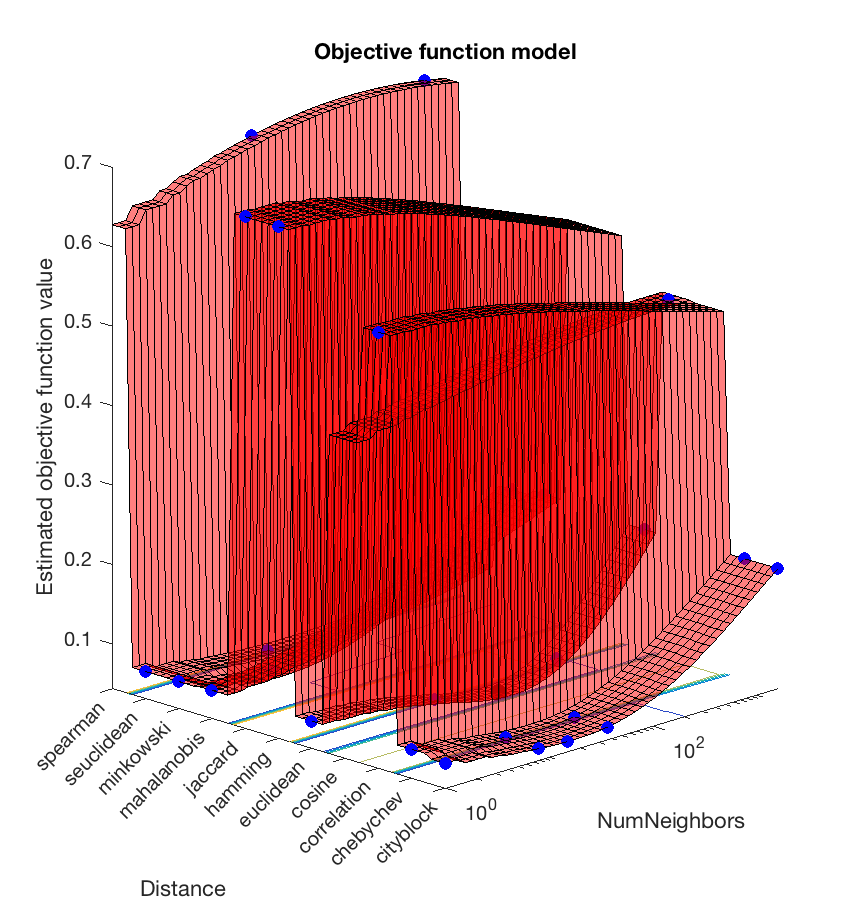
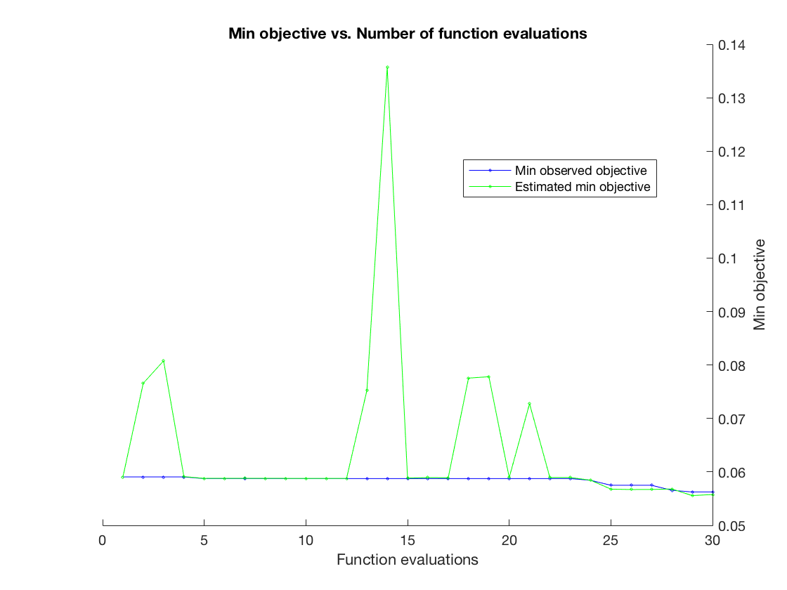
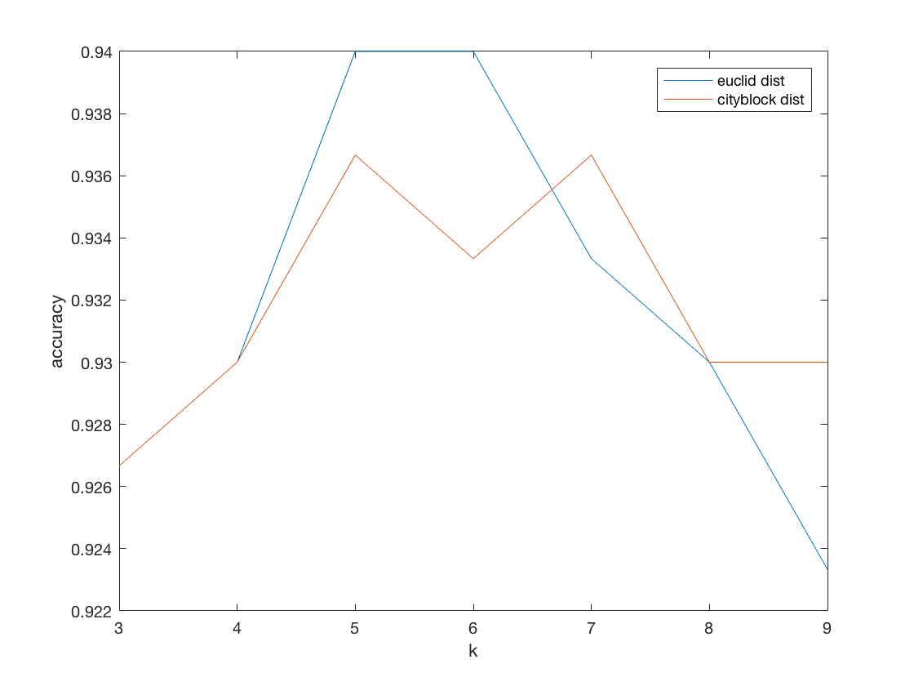
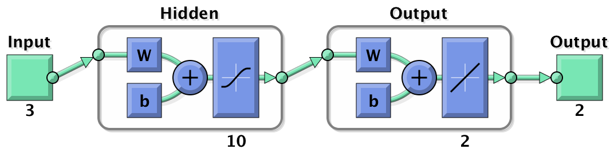
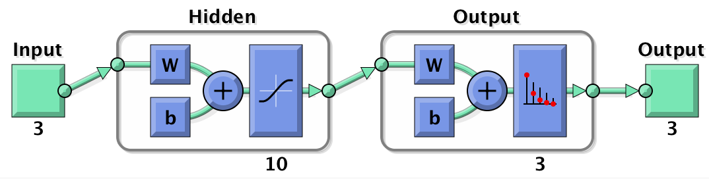
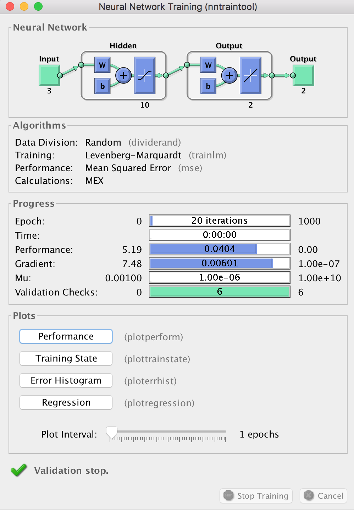
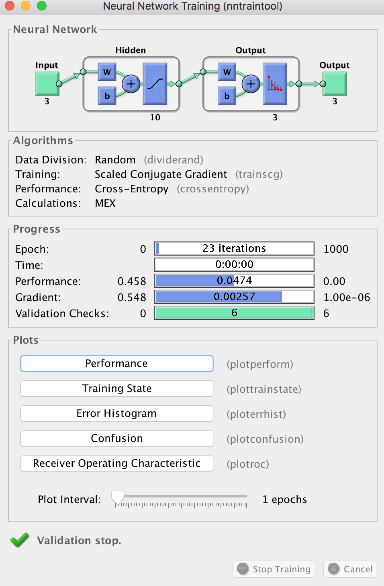
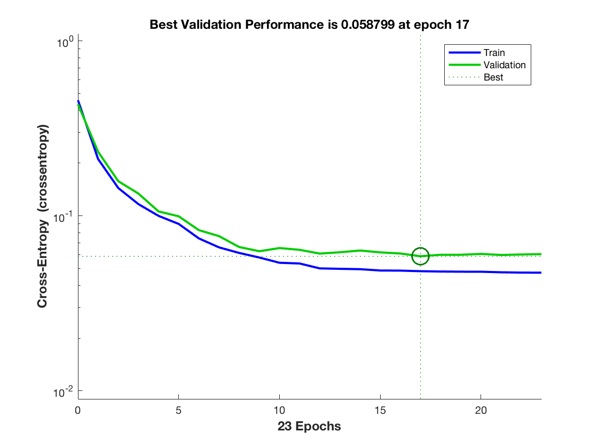

# Pattern Classification & matlab 实现

[TOC]

## Intro

模式识别的几次作业，合在一起。任务是模式分类，包括 KNN，线性分类机，扩展的线性分类机（二次），无监督学习中MLE+最小误差分类，神经网络。还有 K-Means 聚类。

#### 任务描述

1.	已知三个高斯概率密度函数，其类中心分别为：A（1， 1， 1），B（3， 3， 3），C（7， 8， 9）；相应的方差分别为：A（1， 1， 1），B（2， 3， 4），C（6， 6， 9）。
2.	基于上述三个概率密度函数，每类随机产生100个样本，得样本集A1，B1，C1。
3.	基于上述三个概率密度函数，随机产生A2类1000个样本，B2类600个样本，C2类1600个样本。
4.	以D2={A2, B2, C2}为训练样本集，用KNN方法，对D1={A1, B1, C1}中的300个样本进行分类，并计算分类的正确率。其中K=3~9，可以根据自己电脑的计算能力设定。
5.	以D2={A2, B2, C2}为训练样本集，采用线性分类机的方法，对D1={A1, B1, C1}中的300个样本进行分类，并计算分类的正确率。
6.	以D2={A2, B2, C2}为训练样本集，采用扩展的线性分类机（二次）的方法，对D1={A1, B1, C1}中的300个样本进行分类，并计算分类的正确率。
7.	以D2为训练样本集，已知类别数为3。（1）采用K-Means的方法，对D2进行聚类；（2）采样无监督学习中MLE的方法，对D2的概率密度函数、先验概率等进行估计；（3）对D1中的300个样本进行分类，并计算分类的正确率。
8.	以D2={A2, B2, C2}为训练样本集，（1）基于误差回传（backpropagation）训练神经网络：输入层3个神经元，隐含层10个神经元，输出层2个神经元；（2）对D1中的300个样本进行分类，并计算分类的正确率。


#### 实现说明

使用 matlab 实现，代码和报告托管在[github](https://github.com/zqwerty/pattern_classification)上。

## 训练集与测试集

每个类的概率密度函数都服从多元正态分布。$\mu$ 分别为 $[1 ,1, 1], [3, 3, 3], [7, 8, 9]$， $\Sigma$ 分别为 $diag(1,1,1), diag(2,3,4), diag(6,6,9)$。使用matlab中`mvnrnd`函数产生样本，得到训练集和测试集，代码如下：

```matlab
function [train_set, test_set] = gauss_sample()
    muA = [1 1 1];
    muB = [3 3 3];
    muC = [7 8 9];
    sigA = [1 1 1];
    sigB = [2 3 4];
    sigC = [6 6 9];
    train_set{1} = [mvnrnd(muA, sigA, 1000);
                    mvnrnd(muB, sigB, 600);
                    mvnrnd(muC, sigC, 1600)];
    cls = zeros(3200,1);
    cls(1:1000)=1;
    cls(1001:1600)=2;
    cls(1601:3200)=3;
    train_set{2} = cls;
    
    test_set{1} =  [mvnrnd(muA, sigA, 100);
                    mvnrnd(muB, sigB, 100);
                    mvnrnd(muC, sigC, 100)];
    cls = zeros(300,1);
    cls(1:100)=1;
    cls(101:200)=2;
    cls(201:300)=3;
    test_set{2} = cls;
end
```


## KNN

使用`fitcknn`训练KNN模型，使用`predict`根据训练的模型对样本进行分类。

#### 训练

使用`fitcknn`训练时，可以设定参数：最近邻数k，距离度量Distance（如曼哈顿距离，欧氏距离，cos等）。下面使用三种方法进行训练。

##### Euclid Distance

使用欧氏距离，对 k=3:9 遍历，训练，关键代码如下：

```matlab
knnModel = fitcknn(train_set{1,1},train_set{1,2},...
                       'NumNeighbors',k,'Distance','euclidean');
```

##### Cityblock Distance

使用曼哈顿距离，即城区距离，对 k=3:9 遍历，训练，关键代码如下：

```matlab
knnModel = fitcknn(train_set{1,1},train_set{1,2},...
                       'NumNeighbors',k,'Distance','cityblock');
```

##### 自动选取

可以设定参数自动选取 k 和 Distance。关键代码如下：

```matlab
knnModel_auto = fitcknn(train_set{1,1},train_set{1,2},...
                       'OptimizeHyperparameters','auto');
```

训练完成后可以看到 k 和 Distance 变化时目标函数的值，如下：





自动选择使目标函数最小的参数组 (k=15,Distance=cityblock) 作为模型的参数。

#### 测试

测试函数如下，使用`predict`函数测试，将分类结果记录在`res_mat`中。此处类别 A,B,C 分别用 1,2,3 表示，因此可以直接用于`res_mat`的下标。`res_mat`行是分类结果，列是真实类别。

```matlab
function res_mat = test_mdl(mdl, test_set)
    td = test_set{1,1};
    true_label = test_set{1,2};
    label = predict(mdl, td);
    tot = size(label);
    tot = tot(1,1);
    res_mat = zeros(3);
    for i=1:tot
        res_mat(label(i), true_label(i)) = res_mat(label(i), true_label(i)) + 1;
    end
end
```

有了测试函数，可以用上述模型分别进行分类，代码如下：

```matlab
function knn_res = knn_classify(train_set, test_set)
    %     auto fit model
    knnModel_auto = fitcknn(train_set{1,1},train_set{1,2},...
                       'OptimizeHyperparameters','auto');
    knn_auto_res = test_knn(knnModel_auto, test_set)
    knn_auro_acc = sum(diag(knn_auto_res))/300.0
    
    euc_max = 0;
    cty_max = 0;
    euc_res = [];
    cty_res = [];
%     for each k
    for k = 3:9
%         euclidean distance
        knnModel = fitcknn(train_set{1,1},train_set{1,2},...
                       'NumNeighbors',k,'Distance','euclidean');
        res_mat = test_knn(knnModel, test_set);
        crt = sum(diag(res_mat));
        euc_res = [euc_res, crt];
        if(crt>euc_max)
            euc_max = crt;
            knn_euclid_res = res_mat;
        end
%         cityblock distance
        knnModel = fitcknn(train_set{1,1},train_set{1,2},...
                       'NumNeighbors',k,'Distance','cityblock');
        res_mat = test_knn(knnModel, test_set);
        crt = sum(diag(res_mat));
        cty_res = [cty_res, crt];
        if(crt>cty_max)
            cty_max = crt;
            knn_cityblock_res = res_mat;
        end
    end
    
%     plot accuracy for both
    plot(3:9,euc_res/300.0,3:9,cty_res/300.0);
    xlabel('k')
    ylabel('accuracy')
    legend('euclid dist','cityblock dist')
    knn_euclid_res
    knn_cityblock_res
end
```

#### 结果

##### 自动选取参数

自动选取的参数 (k=15,Distance=cityblock) ，分类结果如下。(i, j) 元素表示实际为 j 类但是分成了第 i 类的样本数。准确率为 93.67%。

```matlab
knn_auto_res =
    98    15     0
     2    83     0
     0     2   100
knn_auro_acc =
    0.9367
```
##### Euclid Distance & Cityblock Distance

将两种距离度量的模型进行比较，结果如下：



横轴是 k，纵轴是准确率。可以看到 k=5/6 时 Euclid Distance 准确率达到最高，分类结果如下：

```matlab
knn_euclid_res =
    97    12     0
     3    85     0
     0     3   100
```

k=5/7 时 Cityblock Distance 准确率达到最高，分类结果如下：

```matlab
knn_cityblock_res =
    97    13     0
     3    84     0
     0     3   100
```

比较两者发现虽然 Euclid Distance 表现略好，但是相差并不多。另外 k 的值的影响还是挺大的。再和自动选取参数的方法比较，都在0.935~0.94之间，差别不大。


## 线性分类机

使用`fitcdiscr`函数训练线性分类机的模型。和书中的判别模型的算法如感知器算法和松弛算法不同，此处采用的是生成模型的算法。此处假设每个类都根据不同高斯分布产生样本，即是说，模型假设数据服从高斯混合分布。通过训练确定高斯分布的参数。这与第二章中的内容相似。对于线性分类机，每个类有相同的协方差矩阵，只有均值不同。对于二次线性分类机，均值和协方差矩阵都不同。

线性分类机的训练和测试代码如下，其中测试函数重用了KNN的测试函数，都是对模型在某一数据集上测试。

```matlab
function linear_res = linear_classify(train_set, test_set)
    linearModel = fitcdiscr(train_set{1,1},train_set{1,2});
    res_mat = test_mdl(linearModel, test_set);
    linear_res = res_mat
    linear_acc = sum(diag(linear_res))/300.0
end
```

得到的结果如下：

```matlab
linear_res =
   100    26     0
     0    73     0
     0     1   100
linear_acc =
    0.9100
```

可以看到准确率还是相当不错的，但是比KNN要差一些。

## 扩展的线性分类机（二次）

还是使用`fitcdiscr`函数训练，此时设定参数 'DiscrimType' 为 'quadratic'。与线性分类机很类似，代码如下：

```matlab
function quad_res = quad_classify(train_set, test_set)
    quadModel = fitcdiscr(train_set{1,1},train_set{1,2},...
                            'DiscrimType','quadratic');
    res_mat = test_mdl(quadModel, test_set);
    quad_res = res_mat
    quad_acc = sum(diag(quad_res))/300.0
end
```

得到的结果如下：

```matlab
quad_res =
    98    14     0
     2    84     0
     0     2   100
quad_acc =
    0.9400
```

准确率比线性分类机要高，和KNN最好的结果一样。


## K-Means

#### 简介

K-Means是一种聚类算法，常用于无监督学习中。通常的做法是从样本中随机取出c个作为初始聚类中心，之后不断迭代，按照最近邻分类，重新计算聚类中心，直到聚类中心不再改变。

#### 实现

使用matlab中的 `kmeans()` 函数完成 K-Means 聚类。分别对训练集 D2 和测试集 D1 聚类。 `kmeans()` 函数可指定距离的度量，默认是欧式距离，但我发现使用街区距离效果更好。代码如下：

```matlab
function kmeans_res = K_means(train_set, test_set)
    true_label = train_set{1,2};
    n = size(true_label,1);
%     cluster train set
    [idx,C,sumd,D] = kmeans(train_set{1,1},3,'Distance','cityblock');
    C
    res_mat = zeros(3);
    for k=1:n
        res_mat(idx(k), true_label(k)) = res_mat(idx(k), true_label(k)) + 1;
    end
    train_set_res = res_mat
    
%     cluster test set
    true_label = test_set{1,2};
    n = size(true_label,1);
    [idx,C,sumd,D] = kmeans(test_set{1,1},3,'Distance','cityblock');
    C
    res_mat = zeros(3);
    for k=1:n
        res_mat(idx(k), true_label(k)) = res_mat(idx(k), true_label(k)) + 1;
    end
    test_set_res = res_mat
end
```

#### 结果

- 训练集 D2

  - 欧氏距离

    - 聚类中心：

      ```matlab
          7.1710    8.1366   11.1344
          6.4888    7.7851    6.3135
          1.6769    1.6796    1.7204
      ```

    - 与D2真实标签的对比：(行为聚类标签，列为真实标签)      

      ```matlab
                 0           0         857
                 0          62         722
              1000         538          21
      ```

  - 街区距离 cityblock

    - 聚类中心：

      ```matlab
          7.1977    8.3267    9.3951
          3.8067    4.1431    3.9889
          1.1231    1.1147    1.1046
      ```

    - 与D2真实标签的对比：(行为聚类标签，列为真实标签)      

      ```matlab
                 0           0        1392
                 8         413         207
               992         187           1
      ```

- 测试集 D1

  - 欧氏距离

    - 聚类中心：

      ```matlab
          1.9892    1.8156    2.0202
          7.4843    8.1532    7.1705
          6.6082    8.1399   12.3841
      ```

    - 与D1真实标签的对比：(行为聚类标签，列为真实标签)      

      ```matlab
         100    97     0
           0     3    57
           0     0    43
      ```

  - 街区距离 cityblock

    - 聚类中心：

      ```matlab
          1.2553    0.8565    0.9302
          7.3219    8.5882    9.2567
          3.1136    3.2688    3.5046
      ```

    - 与D1真实标签的对比：(行为聚类标签，列为真实标签)      

      ```matlab
          98    22     0
           0     0    97
           2    78     3
      ```

#### 分析

从以上结果可以得出结论：

1. 在当前任务下，kmeans时使用 cityblock 距离比欧氏距离效果更好。
2. 使用 cityblock 距离时，聚类结果较好的符合真实结果，聚类中心也近似高斯分布的均值。
3. 使用欧氏距离时，效果很差，说明聚类的结果有一定局限性。

## MLE

#### 理论

对于混合正态密度模型，使用 MLE 的相关公式如下：


这些方程是隐式的不利于直接求解，使用迭代法。利用初始估值计算式 (22) ，再用式 (19) (20) (21) 更新这些估计值。如果初始值足够好，就会很快收敛。不可否认，算法的结果完全取决于初始值。

#### 思路

要求用无监督学习中MLE的方法，对D2的概率密度函数、先验概率等进行估计。这里涉及到模型的假设和迭代初值的选取。这里我们假设模型是混合正态密度模型，有三个类别，即总的概率密度是三个类别的条件概率密度加权叠加，要估计的是三个类别的条件概率密度函数、先验概率。迭代初值设置要有区分性，不能都设成一样的，特别是均值。

#### 实现

- 迭代初值设置：
  - prior = [1/3 1/3 1/3]; 假设先验相等
  - mu = [[1 1 1];[2 2 2];[3 3 3]]; 有区分性即可
  - sigma = [diag([1,1,1]);diag([1,1,1]);diag([1,1,1])]; 假设协方差矩阵相同且为单位阵
- 迭代细节
  - 辅助计算：协方差的逆 inv_sigma, 同一类别的“系数” $coef =  |\hat{\Sigma_i}|^{-\frac12}\cdot \hat{P}(\omega_i)$。
  - 最大迭代次数 100。
  - 更新 sigma 时会用到 mu，因此先更新 sigma。

```matlab
function [prior_est, mu_est, sigma_est, inv_sigma_est, coef_est] = MLE(train_set)
%     estimate p(omega_i) & p(x|omega_i)
    x = train_set{1};
    n = size(x,1);
    d = size(x,2);
    c = 3;
%     init
%     prior(i)
    prior = [1/3 1/3 1/3];
%     mu(i,:)
    mu = [[1 1 1];[2 2 2];[3 3 3]];
%     sigma((i-1)*c+1:i*c,:)
    sigma = [diag([1,1,1]);diag([1,1,1]);diag([1,1,1])];
%     inv of sigma
    inv_sigma = [];
    coef = [];
    for i=1:c
        inv_sigma = [inv_sigma; inv( sigma((i-1)*c+1:i*c,:))];
%     |sigma_i|^(-1/2) * P(omega_i)
        coef = [coef; det( sigma((i-1)*c+1:i*c,:))^(-1/2)*prior(i)];
    end
%     post_ik = P(omega_i|x_k,theta)
    post = zeros(c,n);

    max_iter = 100;
    for iter=1:max_iter
%         update post prob
        for i=1:c
            for k=1:n
                post(i,k) = exp(-1/2*(x(k,:)-mu(i,:))* inv_sigma((i-1)*c+1:i*c,:)*(x(k,:)-mu(i,:))');
            end
            post(i,:) = post(i,:) * coef(i);
        end
        for k=1:n
            post(:,k) = post(:,k)/sum(post(:,k));
        end
        
%         update prior
        prior = sum(post,2)/n;
%         update sigma
        for i=1:c
            temp = zeros(d);
            for k=1:n
                temp = temp + post(i,k) * (x(k,:)-mu(i,:))' * (x(k,:)-mu(i,:));
            end
            sigma((i-1)*c+1:i*c,:) = temp/(n*prior(i));
        end
%         update mu
        mu = post * x;
        for i=1:c
            mu(i,:) = mu(i,:)/(n*prior(i));
        end
%         update inv_sigma, coef
        for i=1:c
            inv_sigma((i-1)*c+1:i*c,:) = inv( sigma((i-1)*c+1:i*c,:) );
            coef(i) = det( sigma((i-1)*c+1:i*c,:))^(-1/2)*prior(i);
        end
    end
    prior_est = prior;
    mu_est = mu;
    sigma_est = sigma;
    inv_sigma_est = inv_sigma;
    coef_est = coef;
end
```

#### 结果

对D2的条件概率密度函数、先验概率等进行估计，结果如下：

- 先验概率

  ```matlab
  prior =
      0.3101
      0.1954
      0.4944
  ```

- 各类别条件概率密度函数多元高斯分布的参数：均值和协方差矩阵

  ```matlab
  mu =
      0.9627    1.0231    1.0321
      3.0742    3.0640    3.1344
      6.9327    8.0668    8.9681
      
  sigma1 =
      0.9755    0.0037    0.0378
      0.0037    0.9584    0.0209
      0.0378    0.0209    0.9745

  sigma2 =
      1.9568   -0.0167    0.1520
     -0.0167    3.1452   -0.0206
      0.1520   -0.0206    4.0717

  sigma3 =
      6.0188   -0.0639    0.1350
     -0.0639    5.5689   -0.1687
      0.1350   -0.1687    8.8757
  ```

可以看到均与真实值较为接近。改变mu值为`[[1 2 3];[2 3 1];[3 1 2]]`, 得到的结果差不多。说明在初值选择合适的情况下，MLE 还是能有很好效果的。


## 最小误差率分类

#### 理论

通过 MLE 得到三个类别的条件概率密度函数、先验概率之后，对给定样本点，便可通过贝叶斯公式：
$$
P(\omega_i|\mathbf{x})=\frac{P(\omega_i)\cdot p(\mathbf{x}|\omega_i)}{p(\mathbf{x})}
$$
计算各类别后验概率。之后依照最小误差率分类原则，选择后验概率最大的类别作为样本点的类别。实际使用中，考虑条件概率密度函数有多元正态分布的形式，可用判别函数替代后验概率，省去相同量的计算：
$$
g_i(\mathbf{x})=P(\omega_i)\cdot |\Sigma_i|^{-\frac12}exp(-\frac12(\mathbf{x}-\mu_i)^t\Sigma_i^{-1}(\mathbf{x}-\mu_i))
$$
选择使得判别函数最大的类别 i 。

#### 实现

根据 MLE 部分的代码，利用条件概率密度函数、先验概率做最小误差率分类。

```matlab
function mle_res = mle_classify(train_set, test_set)
    x = test_set{1,1};
    true_label = test_set{1,2};
    n = size(true_label,1);
    c = 3;
    res_mat = zeros(3);
    
    [prior, mu, sigma,  inv_sigma, coef] = MLE(train_set);
    
    for k=1:n
%         calculate unnormalize Posterior_i = Prior_i * p(x|\omega_i)
        post = zeros(1,3);
        for i=1:c
            post(i) = coef(i) * exp(-1/2*(x(k,:)-mu(i,:))* inv_sigma((i-1)*c+1:i*c,:)*(x(k,:)-mu(i,:))');
        end
        [max_post, max_post_index] = max(post);
        res_mat(max_post_index, true_label(k)) = res_mat(max_post_index, true_label(k)) + 1;
    end
    mle_res = res_mat
    mle_acc = sum(diag(mle_res))/300.0
end
```

#### 结果

得到的结果如下：

```matlab
mle_res =
    98    13     0
     2    85     0
     0     2   100

mle_acc =
    0.9433
```

可以看到准确率还是相当不错的，然而这是建立在对参数估计的比较准确的情况下的。如果 MLE 对参数的估计差很多，想来分类结果也不会太好。


## Multilayer Neural Networks

#### 简介

多层神经网络可用于捕获数据中的非线性特征，基本思想是将输入投影到非线性空间，最后套一层线性判别。训练时广泛使用BP算法，简单易于计算。除了在模式识别领域，多层神经网络及其变种还广泛应用在在自然语言处理，语音识别等领域。

#### 思路

一般而言，对于模式分类任务，MLP输出神经元数目和类别数相同，输出结果套一个softmax得到输入的类别分布情况


预测时选择softmax值最大的作为预测类别输出。


然而要求**神经网络输出层2个神经元**，这样就不能用一般的方法来做了。直接的想法是每个类对应二维输出的一个点 $y_1,y_2,y_3$，变成一般的MLP训练问题。预测时选择 i 使得  $y_i$ 距离输出 y 最近。相当于在二维平面上以 $y_i$ 为中心划分为三块，对应三类。

#### 两个输出神经元的实现

matlab中提供了神经网络相关的函数，此处用了 

- `net = feedforwardnet(hidden_size)` 创建网络结构
- `net = train(net,input,output);` 训练
- `y = net(input)` 预测输出



##### 数据预处理

首先对数据进行预处理，设定 $y_1,y_2,y_3$ ，将类别映射到 $y_1,y_2,y_3$ 三个点：

```matlab
    y1 = [1 1];
    y2 = [2 2];
    y3 = [3 3];
    for k=1:n
        if label(k) == 1
            output(k,:) = y1;
        elseif label(k) == 2
            output(k,:) = y2;
        elseif label(k) == 3
            output(k,:) = y3;
        end
    end
```

##### 模型创建和训练

之后创建神经网络，设置参数，训练。训练算法默认为 `Levenberg-Marquardt backpropagation`

```matlab
    net = feedforwardnet(10);
    net.divideParam.trainRatio = 0.9;
    net.divideParam.valRatio = 0.1;
    net.divideParam.testRatio = 0;
    net = train(net,input,output);
```

##### 测试

```matlab
    x = test_set{1,1}';
    true_label = test_set{1,2};
    y = net(x)';	% 转置方便后续处理
```

##### 数据后处理

将测试结果取到  $y_i$ 距离最小的 i 作为类别输出
$$
y_{pred} = argmin_i ||y-y_i||_2
$$
并统计结果。完整代码见 `hw9.m`

```matlab
    res_mat = zeros(3);
    for k=1:n
        yk = y(k,:);
        dist = [norm(y1-yk), norm(y2-yk), norm(y3-yk)];
        [d, l] = min(dist);
        res_mat(l, true_label(k)) = res_mat(l, true_label(k)) + 1;
    end
    nn_res = res_mat
    nn_acc = sum(diag(nn_res))/300.0
```

#### 三个输出神经元的实现

matlab中提供了 `patternnet` 专门用于模式分类任务，但是要求类别数等于输出神经元个数。在此使用三个输出神经元实现，与之前的结果进行对比。模型如下：



实现代码较简单：

```matlab
function nn_res = nn2_classify(train_set, test_set)
    input = train_set{1,1}';
    ind = train_set{1,2}';
    output = full(ind2vec(ind));
    
    % train
    net = patternnet(10);
    net.divideParam.trainRatio = 0.9;
    net.divideParam.valRatio = 0.1;
    net.divideParam.testRatio = 0;
    net = train(net,input,output);
    view(net);
    
    % test
    x = test_set{1,1}';
    true_label = test_set{1,2};
    y = net(x);
    [s y] = max(y);
    res_mat = zeros(3);
    n = size(x,2);
    for k=1:n
        res_mat(y(k),true_label(k)) = res_mat(y(k), true_label(k)) + 1;
    end
    nn_res = res_mat
    nn_acc = sum(diag(nn_res))/300.0
end
```


#### 结果

##### 训练

**两个**输出神经元的实现




**三个**输出神经元的实现





对比可以发现两个输出神经元训练收敛较快，猜想是因为三个输出神经元的取值是离散的。

##### 测试

**两个**输出神经元的实现
分类情况和准确率：

```matlab
nn_res =
    97    12     0
     3    84     0
     0     4   100
     
nn_acc =
    0.9367
```

**三个**输出神经元的实现
分类情况和准确率：

```matlab
nn_res =
    97    14     0
     3    82     0
     0     4   100
     
nn_acc =
    0.9300
```

对比之下**两个**输出神经元的实现效果略好一些，但是相差不大。可能是因为**两个**输出神经元的实现相当于在输出后又接了一个线性判别器对二维平面的点分类。


## 总结

分别使用KNN，线性分类机，扩展的线性分类机（二次）完成同样的分类任务，加上了我对于算法的理解和比较。从结果上可以看出，线性分类机要比其他两种模型弱一些，这也是很合理的，因为线性分类机的假设较强，对于有一些混淆的数据无法做到很好的处理。扩展的线性分类机（二次）比线性分类机好，因为它更加复杂，更加逼近真实的边界。KNN的效果也非常好，是简单而有效的方法。

Kmeans聚类算法，思想简单，但很有效。当分量密度互相之间重叠很小时，最大似然方法和kmeans会给出大致一样的结果。Kmeans对距离的度量也是可适配的。

在无监督任务中，参数的估计变得更加复杂，更加难以求解，而且解可能有多个。在合理的假设下，我们可以简化求解过程求得近似解。对于无监督 MLE，合理的假设是混合正态密度模型，利用迭代法求解，解的质量和初值有很大关系。

